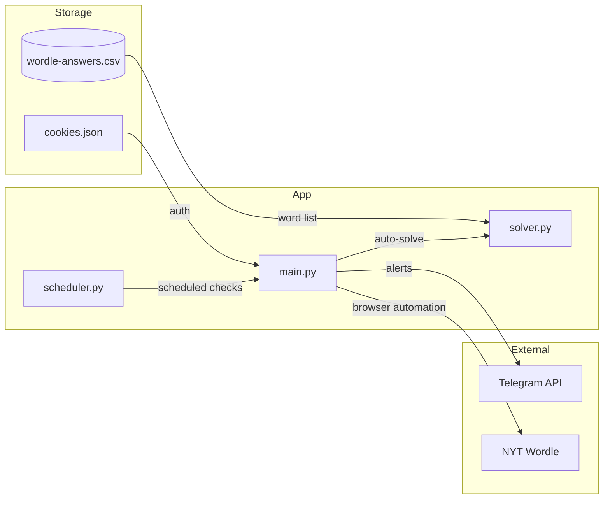

# Wordle Alarm

Automated NYT Wordle checker that sends Telegram alerts if you haven't played, and auto-solves the puzzle late at night.

## Tech Stack

Python 3.12, Playwright (browser automation), BeautifulSoup (HTML parsing), Pandas (word filtering), Schedule (cron-like jobs), Telegram Bot API (notifications)

## Architecture



## Prerequisites

- Python 3.12
- Poetry
- Chromium (installed via Playwright)
- Telegram Bot token and chat ID
- NYT Wordle cookies (for authenticated session)

## Installation

1. Clone the repository:
   ```bash
   git clone https://github.com/momonala/wordle-alarm.git
   cd wordle-alarm
   ```

2. Install dependencies:
   ```bash
   pip install poetry
   poetry install --no-root
   ```

3. Install Playwright browsers:
   ```bash
   playwright install chromium
   playwright install-deps
   ```

4. Configure credentials in `values.py`:
   ```python
   TELEGRAM_TOKEN = "your-bot-token"
   TELEGRAM_CHAT_ID = "your-chat-id"
   ```

5. Export NYT cookies to `assets/cookies.json`:
   - Log into nytimes.com/games/wordle
   - Use a browser extension to export cookies as JSON
   - Save to `assets/cookies.json`

   Required cookie format:
   ```json
   [
     {
       "name": "cookie-name",
       "value": "cookie-value",
       "domain": ".nytimes.com",
       "path": "/",
       "sameSite": "Lax",
       "secure": true,
       "httpOnly": false,
       "expirationDate": 1234567890
     }
   ]
   ```

## Running

**Manual check:**
```bash
python main.py
```

**Scheduled daemon:**
```bash
python scheduler.py
```

Default schedule: 10:00, 17:00, 20:00, 22:30, 23:30 daily

## Project Structure

```
wordle-alarm/
├── main.py                   # Entry point, Wordle status checker
├── solver.py                 # Auto-solver algorithm and game state
├── scheduler.py              # Cron-like scheduler daemon
├── auth.py                   # Cookie loading/formatting for Playwright
├── values.py                 # Telegram credentials (gitignored)
├── wordle-answers.csv        # Word list with frequency scores
├── pyproject.toml            # Poetry dependencies
├── assets/
│   └── cookies.json          # NYT session cookies (gitignored)
├── install/
│   ├── install.sh            # Linux setup script
│   └── projects_wordle_alarm.service  # systemd unit file
└── tmp/                      # Debug dumps (HTML pages)
```

## Key Concepts

| Concept | Description |
|---------|-------------|
| `GameMode.PLAY` | Game not started today |
| `GameMode.CONTINUE` | Game started but incomplete |
| `WordleState` | Tracks all guesses and tile states |
| `Tile` | Single letter with position and state (`correct`, `present`, `absent`) |
| Late night | After 22:00 - triggers auto-solve |
| `frequency` | Word commonality score in CSV, higher = more likely answer |

## Data Models

```
WordleState
├── guesses: dict[GuessNumber, list[Tile]]
│   └── GuessNumber: FIRST through SIXTH
└── Tile
    ├── pos: int (1-5)
    ├── letter: str
    └── state: str (correct|present|absent)
```

## Solver Algorithm

1. Start with "trace" as first guess
2. Parse tile states from page HTML
3. Filter word list by:
   - Correct letters in correct positions
   - Present letters not in wrong positions
   - Absent letters excluded (unless present elsewhere)
4. Select highest-frequency remaining word
5. Repeat until solved or 6 guesses exhausted

## Storage

| File | Purpose |
|------|---------|
| `assets/cookies.json` | NYT authentication cookies |
| `wordle-answers.csv` | 14,856 five-letter words with frequency scores |
| `tmp/wordle_page_dump.html` | Debug: last page HTML dump |

## Deployment (Linux)

The `install/` directory contains systemd setup:

```bash
./install/install.sh
```

This creates a conda environment, installs dependencies, and registers a systemd service that runs `scheduler.py` as a daemon.

Service management:
```bash
sudo systemctl status projects_wordle_alarm.service
sudo systemctl restart projects_wordle_alarm.service
sudo journalctl -u projects_wordle_alarm.service -f
```

## Environment Variables

None. All config is in `values.py` and `assets/cookies.json`.

## Known Limitations

- Requires valid NYT cookies (expires periodically)
- Headless Chromium may break with NYT site changes
- Word list is static, doesn't update with new official answers
- No retry logic for network failures
